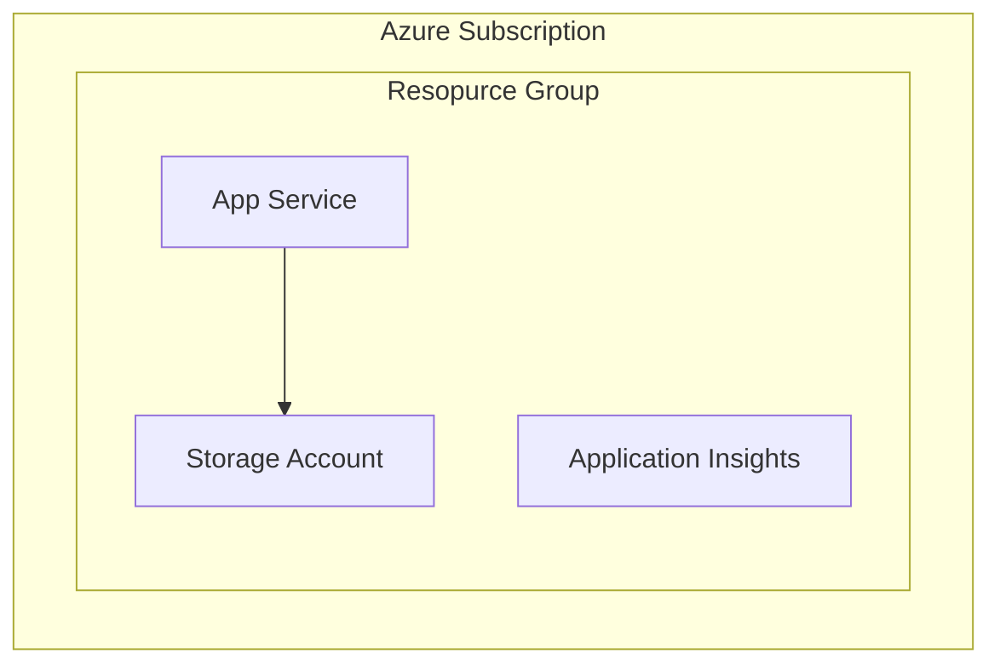

# Azure RBAC & ABAC Demo

This project demonstrates the implementation and differences between **Role-Based Access Control (RBAC)** and **Attribute-Based Access Control (ABAC)** in Azure, specifically focusing on Azure Storage access scenarios.

## Overview

The demo consists of:
- **ASP.NET Core Web Application**: A frontend that allows users to visualize contents in Azure Storage accounts and view statistics for containers.
- **Azure Infrastructure**: Includes Application Insights, Azure App Service, and Azure Storage Account deployed via Bicep templates.

---

## Understanding RBAC and ABAC

### Role-Based Access Control (RBAC)

**RBAC** is a method of regulating access to resources based on the roles of individual users within an organization. In Azure:

- Access is granted by assigning **roles** to users, groups, service principals, or managed identities.
- Roles define a set of **permissions** (actions that can be performed on resources).
- RBAC works at different **scopes**: Management Group, Subscription, Resource Group, or individual Resource.

**Example**: Assigning the `Storage Blob Data Reader` role to a user grants them read access to all blobs in the storage account.

**Pros**:
- Simple to implement and manage
- Well-suited for organizations with clear role hierarchies

**Cons**:
- Can lead to role explosion in complex scenarios
- Limited granularity for fine-grained access control

### Attribute-Based Access Control (ABAC)

**ABAC** extends RBAC by adding **conditions** based on attributes. In Azure, this is implemented through **role assignment conditions**.

- Access decisions are based on **attributes** of the principal, resource, request, and environment.
- Conditions are written using expressions that evaluate attributes at runtime.
- Enables **fine-grained access control** without creating multiple role assignments.

**Example**: Grant a user access to blobs only if the blob has a specific tag (e.g., `Project=Alpha`) or if the blob path starts with a specific prefix.

**Pros**:
- Highly granular access control
- Reduces the number of role assignments needed
- Dynamic and context-aware authorization

**Cons**:
- More complex to configure and troubleshoot
- Requires understanding of condition syntax

### Key Differences

| Aspect | RBAC | ABAC |
|--------|------|------|
| **Granularity** | Role-level | Attribute-level |
| **Flexibility** | Static permissions | Dynamic, condition-based |
| **Complexity** | Lower | Higher |
| **Use Case** | Broad access control | Fine-grained access control |
| **Azure Implementation** | Role assignments | Role assignments with conditions |

---

## Architecture



---

## Prerequisites

Before deploying this demo, ensure you have:

1. **Azure Subscription**: An active Azure subscription
2. **Azure Developer CLI (azd)**: Version 1.0.0 or later
   - [Install Azure Developer CLI](https://learn.microsoft.com/azure/developer/azure-developer-cli/install-azd)
3. **Azure CLI**: For authentication
   - [Install Azure CLI](https://learn.microsoft.com/cli/azure/install-azure-cli)
4. **.NET 10 SDK**: Required to build the web application
   - [Download .NET](https://dotnet.microsoft.com/download)

---

## Deploying with Azure Developer CLI (azd)

The Azure Developer CLI (`azd`) simplifies the deployment process by managing infrastructure provisioning and application deployment.

### Step 1: Clone the Repository

```bash
git clone https://github.com/massimobonanni/Azure-ABAC-Demo.git
cd Azure-ABAC-Demo
```

### Step 2: Authenticate with Azure

Log in to your Azure account:

```bash
azd auth login
```

This will open a browser window for authentication. Follow the prompts to sign in.

### Step 3: Provision Infrastructure and Deploy

Run the following command to provision Azure resources and deploy the application:

```bash
azd up
```

You'll be prompted to:

- Enter an **environment name** (e.g., `dev`, `prod`, or `abac-demo`)
- Select your **Azure subscription**
- Select the **Azure region** for deployment
  
This command will:

1. **Provision** the Azure infrastructure defined in the `infra/` folder (using Bicep templates)
2. **Build** the .NET web application
3. **Deploy** the application to Azure App Service

The deployment typically takes 5-10 minutes.
After successful deployment, `azd` will output the URL of your deployed web application. Open this URL in your browser to access the demo.

### Step 4: Upload demo blobs

After successful deployment, follow the instructions in [this page](.\data\readme.md) to upload the blobs for the demo.

---

### Clean Up Resources

To delete all Azure resources created by this demo:

```bash
azd down
```

> ⚠️ **Warning**: This will permanently delete all resources including the storage account and its data.

---

## Demo steps

### Step 1: Using the app without roles

After deploying the demo on Azure, you follow the steps:

1. Navigate to the home page of the App Service;
2. Open the containers page;
3. You should receive an authorization error because the App Service managed identity has no role assigned on the Storage Account.

### Step 2: Assign a role to the app

The App Service is deployend with a System-Assigned Managed Identity.
In this step you, assign the `Storage Blob Data Reader` role to the App Service Managed Identity.
Follows the steps:

1. Open the Azure portal and go to the **Storage account** created by the deployment.
2. In the left menu, select **Access control (IAM)**.
3. Select **+ Add** > **Add role assignment**.
4. In the **Role** tab, search for and select **Storage Blob Data Reader**.
5. In the **Members** tab:
   - **Assign access to**: select **Managed identity**.
   - Select **+ Select members**.
   - In **Managed identity**, choose **App Service**.
   - Select your deployed Web App (the App Service created by `azd up`) and then **Select**.
6. In the **Review + assign** tab, select **Review + assign**.
7. Wait 1–2 minutes for permissions to propagate, then refresh the app and open the **Containers** page again.

After assigning the role, repeat the steps in **Step 1: Using the app without roles**. Now you should see the list of the containers, for each container the list of blobs and the content of each blob.

> Tip: If you still get an authorization error after assigning the role, wait a bit longer and try again. RBAC changes can take a few minutes to take effect.


### Step 3: Assign a condition to the role of the app

In this step, you configure the ABAC condition to read only blobs with a tag index `category = invoice`:

1. Open the Azure portal and go to the **Storage account** created by the deployment.
2. In the left menu, select **Access control (IAM)**.
3. Select **Role assignments** tab and search for the App Service Managed Identity.
4. Click on **Add** link on the right side.
5. In the **Condition #1** section, click on **+ Add action** (sub-section **1. Add action**).
6. Select **Read a blob** action (You are selecting the action you want to allow when the condition is true) and press **Select**.
7. In the **Condition #1** section, click on **+ Add expression** (sub-section **2. Build expression**).
8. Use the following configurations (leave all the other configuration as default):
   - Attribute source : `Resource`,
   - Attribute : `Blob index tags [Values in key]`,
   - Key : `category`,
   - Operator : `StringEqualsIgnoreCase`,
   - Value : `invoice`
9.Save the condition pressing `Save` button

> Tip: If you still read blobs with a category not equal to `invoice` after assigning the condition, wait a bit longer and try again. ABAC changes can take a few minutes to take effect.

---
## Additional Resources

- [Azure RBAC Documentation](https://learn.microsoft.com/azure/role-based-access-control/overview)
- [Azure ABAC Documentation](https://learn.microsoft.com/azure/role-based-access-control/conditions-overview)
- [Azure Developer CLI Documentation](https://learn.microsoft.com/azure/developer/azure-developer-cli/)
- [Azure Storage Authorization](https://learn.microsoft.com/azure/storage/blobs/authorize-data-access)

---

## License

This project is provided for demonstration purposes.

## Author

[Massimo Bonanni](https://github.com/massimobonanni)
